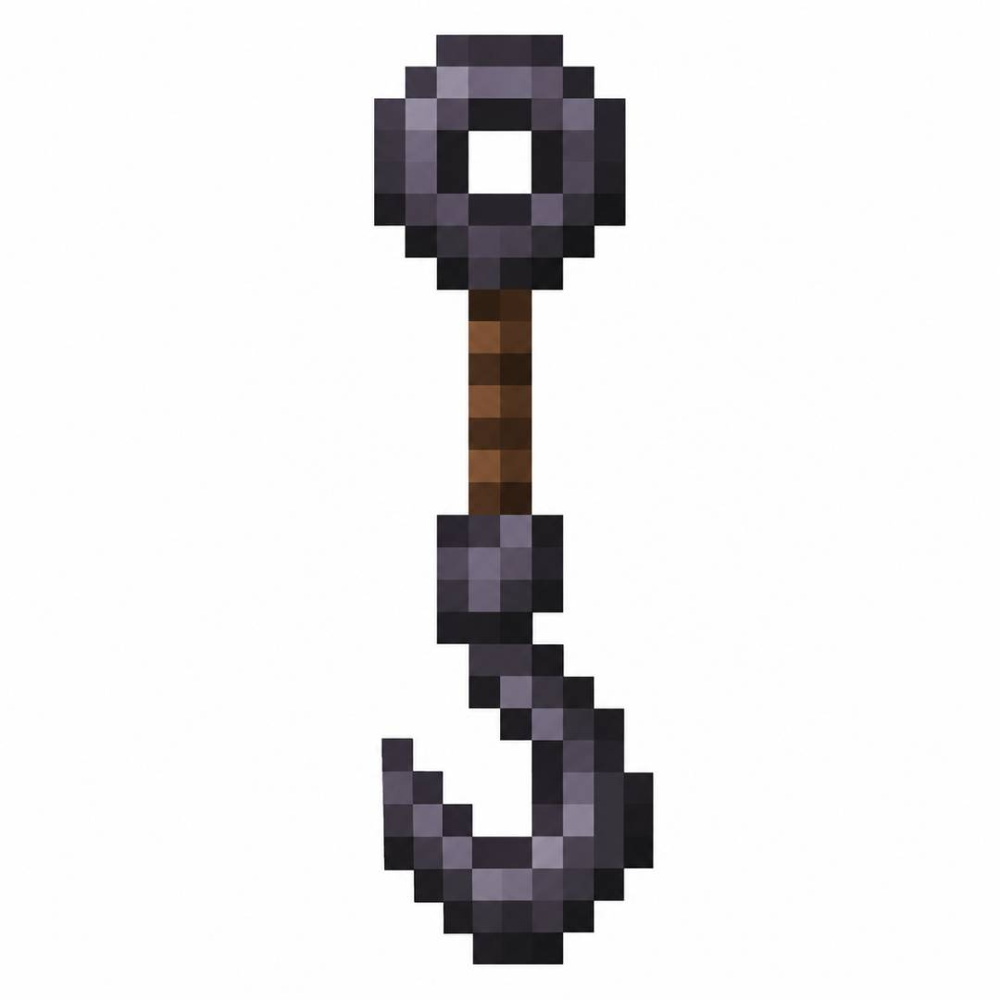

<div align="center">
    
    <div>
        <p style="margin: 0; font-size: 32px; font-weight: 700;">HookCraft</p>
        <p style="margin: 4px 0 0 0; font-size: 16px; color: #8b949e;">
            基于 <strong>Minecraft 1.21.11</strong> 开发的辅助型 Fabric 客户端模组
        </p>
    </div>
</div>

---

## 环境要求

- **JDK 21** 或更高版本 (推荐使用Eclipse Temurin JDK)

---

## 构建方式

### macOS / Linux

```bash
./gradlew build
```

### Windows

```cmd
gradlew.bat build
```

---

## 构建产物

构建成功后，模组文件位于：

```
HookCraft/build/libs/hookcraft-mod-<版本号>.jar
```

---

## 使用说明

1. 确保Minecraft版本为**1.21.11**
2. 确保安装**Fabric Loader**和**Fabric API**
3. 将构建出的 .jar 文件放入游戏目录的 mods 文件夹

---

## 备注

已注册快捷按键功能及其对应快捷键：

|    功能    |  绑定按键  |
|:--------:|:------:|
| KillAura |   R    |
|   Bhop   |   C    |
|  Speed   |   V    |
| ClickGui | 右Shift |